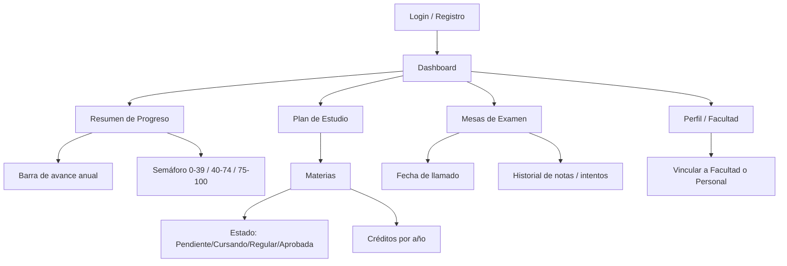

# Diseño de la Home — Plataforma de Gestión de Carrera e Historial Académico

## Vista General

La Home es el punto central de la aplicación luego de autenticarse. Una vez que el usuario ingresa (Login) o se registra (Registro), es redirigido al **Dashboard**, desde donde accede a las distintas secciones que componen la experiencia académica.

## Estructura de Componentes

El flujo de navegación se organiza en componentes de alto nivel:

- **Login / Registro**: Autenticación del usuario (estudiante o personal).
- **Dashboard**: Componente raíz post-login que contiene la navegación y el área de contenido.
- **Resumen de Progreso**: Widget de seguimiento del avance anual, con barra de avance y semáforo.
- **Plan de Estudio**: Listado de materias con su estado y créditos por año académico.
- **Mesas de Examen**: Calendario de llamados e historial de notas / intentos.
- **Perfil / Facultad**: Vinculación del usuario a una Facultad o movimiento como Personal.

## Diagrama

