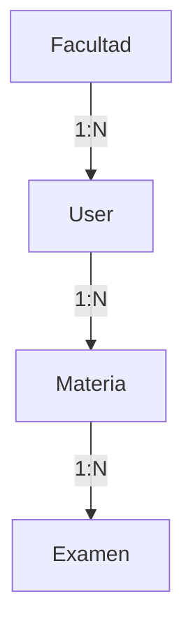

# Proyecto: Plataforma de Gestión de Carrera e Historial Académico

## 📝 Descripción
Diseñada para que estudiantes universitarios puedan centralizar la gestión de su trayectoria académica de manera dinámica y eficiente. Permite cargar el plan de estudio completo, realizar el seguimiento de las cursadas (promociones, regularidades) y administrar las mesas de examen final, incluyendo el registro histórico de intentos y calificaciones.

El sistema actúa como un monitor de progreso que permite:
* Visualizar materias pendientes para el título.
* Diferenciar entre cursada aprobada y examen final pendiente.
* Gestionar fechas de mesas de examen e intentos por materia.
* Centralizar la información según la institución (Facultad).

---

## 🛠️ Stack Tecnológico (Implementación TP2)
El backend ha sido desarrollado siguiendo los estándares de una API REST robusta:

- **Framework**: [Django 6.0.3](https://www.djangoproject.com/)
- **API Framework**: [Django REST Framework 3.17.1](https://www.django-rest-framework.org/)
- **Base de Datos**: [PostgreSQL](https://www.postgresql.org/) (Sustituyendo a SQLite para entorno de producción/desarrollo avanzado).
- **Documentación API**: [drf-spectacular](https://drf-spectacular.readthedocs.io/) (OpenAPI 3.0 / Swagger UI).
- **CORS**: `django-cors-headers` para integración con frontend.

---

## 🚀 Estado de Implementación

### 1. Modelado de Datos
Se han implementado las siguientes entidades en la base de datos:
- **Facultad**: Gestión de instituciones y sedes.
- **User**: Usuario personalizado extendiendo `AbstractUser` para incluir vinculación institucional y plan de estudio.
- **Materia**: Gestión de asignaturas, créditos y estados (`Pendiente`, `Cursando`, `Regular`, `Aprobada`, `Recursando`).
- **Examen**: Registro de evaluaciones con tipos (`Parcial`, `Final`, `Promoción`) y notas.

### 2. API REST (CRUD)
Se han expuesto los siguientes endpoints mediante `ModelViewSet`:
- `/api/facultades/` $\rightarrow$ Gestión de facultades.
- `/api/materias/` $\rightarrow$ Gestión de materias del estudiante.
- `/api/examenes/` $\rightarrow$ Historial de exámenes.

### 3. Documentación Interactiva
La API cuenta con documentación automática accesible en:
- **Swagger UI**: `http://127.0.0.1:8000/api/docs/`
- **Schema**: `http://127.0.0.1:8000/api/schema/`

### 4. Panel de Administración
Configurado el `django-admin` para permitir la gestión visual de todas las entidades con filtros de búsqueda y visualización optimizada.

---

## 📐 Modelo Conceptual y Relaciones

### Entidades Principales
- **Facultad**: `id`, `nombre`, `sede`.
- **Usuario**: `id`, `facultad_id` (FK), `username`, `email`, `plan_estudio_nombre`.
- **Materia**: `id`, `usuario_id` (FK), `nombre`, `año_dictado`, `creditos_totales`, `estado`, `es_promocionable`.
- **Examen**: `id`, `materia_id` (FK), `fecha`, `nota`, `tipo`.

### Relaciones
- **User $\leftrightarrow$ Facultad (N:1)**: Muchos usuarios pertenecen a una misma facultad.
- **User $\leftrightarrow$ Materia (1:N)**: Un usuario gestiona su propio plan de estudio con múltiples materias.
- **Materia $\leftrightarrow$ Examen (1:N)**: Una materia tiene un historial de múltiples intentos de examen.

### Diagrama de Relaciones


---

## ⚙️ Configuración Local

### Requisitos
- Python 3.13+
- PostgreSQL instalado y corriendo.

### Pasos de Instalación
1. **Clonar el repositorio** y crear el entorno virtual:
   ```bash
   python -m venv venv
   .\venv\Scripts\activate
   ```
2. **Instalar dependencias**:
   ```bash
   pip install -r requirements.txt
   ```
3. **Configurar Base de Datos**: Crear la base de datos `programacion1_db` y el usuario `postgres_django_user` en PostgreSQL.
4. **Migraciones**:
   ```bash
   python manage.py migrate
   ```
5. **Ejecutar Servidor**:
   ```bash
   python manage.py runserver
   ```
