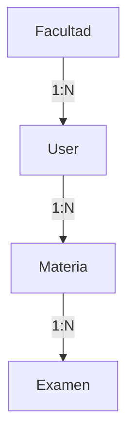

# Proyecto: Plataforma de Gestión de Carrera e Historial Académico

## 📝 Descripción
Diseñada para que estudiantes universitarios puedan centralizar la gestión de su trayectoria académica de manera dinámica y eficiente. Permite cargar el plan de estudio completo, realizar el seguimiento de las cursadas (promociones, regularidades) y administrar las mesas de examen final, incluyendo el registro histórico de intentos y calificaciones.

La idea principal es que el sistema no sea solo una lista de materias, sino un monitor de progreso que permita:
* Visualizar qué materias faltan para el título.
* Diferenciar entre cursada aprobada y examen final pendiente.
* Gestionar las fechas de mesas de examen y la cantidad de intentos por materia.
* Centralizar la información según la facultad del estudiante.

---

## 🎯 Objetivos del Proyecto

### Objetivo General
Desarrollar una plataforma web para la administración integral del progreso académico y la planificación de exámenes.

### Objetivos Específicos
* Implementar registro e inicio de sesión de estudiantes.
* Permitir la carga y edición del plan de estudio personal.
* Gestionar el estado de cada materia (Cursando, Regular, Aprobada, Libre).
* Registrar fechas de exámenes finales y sus resultados (notas, condición).
* Integrar una entidad institucional (Facultad) para la validez de los datos.

---

## 🌐 Alcance del Sistema

### Gestión de Usuarios e Institución
* **Autenticación**: Registro, inicio y cierre de sesión seguro.
* **Vinculación Institucional**: Posibilidad de asociar el perfil a una Facultad específica o mantenerlo como Personal.

### Administración del Plan de Estudio
* **Carga de Materias**: Registro de asignaturas incluyendo nombre y carga de créditos/horas.
* **Control de Créditos**: Sumatoria automática de créditos obtenidos por materia aprobada y contador de créditos necesarios por año académico.
* **Seguimiento de Estados**: Visualización del estado individual (Pendiente, Cursando, Regular, Aprobada) y estado general del año lectivo.

### Gestión de Exámenes y Calificaciones
* **Historial de Notas**: Registro de calificaciones de cursada y promociones.
* **Módulo de Finales**: Gestión de mesas de examen, fechas de llamado y contador de intentos.

### Visualización de Progreso (Dashboard)
* **Monitor de Carrera**: Visualización del año actual con una barra de progreso dinámica.
* **Lógica de Semáforo**: 
    * 🔴 Crítico/Inicio: (0% - 39%)
    * 🟡 En Proceso: (40% - 74%)
    * 🟢 Avanzado/Completado: (75% - 100%)

---

## 🛠️ Implementación Técnica (TP 2)

El proyecto ha evolucionado de una fase conceptual a una implementación real de Backend utilizando el siguiente stack:

- **Framework**: Django 6.0.3
- **API Framework**: Django REST Framework 3.17.1
- **Base de Datos**: PostgreSQL (Migrado desde SQLite para mayor robustez).
- **Documentación**: drf-spectacular (Swagger UI accesible en `/api/docs/`).
- **CORS**: `django-cors-headers` configurado para frontend.

### 🚀 Estado Actual del Desarrollo
Se han implementado los siguientes módulos funcionales:
1. **Modelado de Datos**: Entidades `Facultad`, `User` (custom), `Materia` y `Examen` plenamente operativas.
2. **API REST (CRUD)**: Endpoints funcionales para la gestión de todas las entidades.
3. **Panel de Administración**: Configurado el `django-admin` para gestión visual de datos.
4. **Migraciones**: Estructura de base de datos desplegada en PostgreSQL.

---

## 📐 Modelo de Datos y Relaciones

### Entidades Principales
- **Facultad**: `id`, `nombre`, `sede`.
- **Usuario**: `id`, `facultad_id` (FK), `username`, `email`, `plan_estudio_nombre`.
- **Materia**: `id`, `usuario_id` (FK), `nombre`, `año_dictado`, `creditos_totales`, `estado`, `es_promocionable`.
- **Examen**: `id`, `materia_id` (FK), `fecha`, `nota`, `tipo`.

### Reglas de Integridad
* **ON DELETE CASCADE**: Al eliminar un usuario, se eliminan sus materias y exámenes asociados.
* **Relación Unidireccional**: El flujo de datos es descendente desde la Institución $\rightarrow$ Usuario $\rightarrow$ Materia $\rightarrow$ Examen.

### Diagrama de Relaciones


---

## ⚙️ Configuración Local

### Requisitos
- Python 3.13+
- PostgreSQL instalado y corriendo.

### Pasos de Instalación
1. **Entorno Virtual**:
   ```bash
   python -m venv venv
   .\venv\Scripts\activate
   ```
2. **Dependencias**:
   ```bash
   pip install -r requirements.txt
   ```
3. **Base de Datos**: Crear la base de datos `programacion1_db` y el usuario `postgres_django_user` en PostgreSQL.
4. **Migraciones**:
   ```bash
   python manage.py migrate
   ```
5. **Ejecutar**:
   ```bash
   python manage.py runserver
   ```
