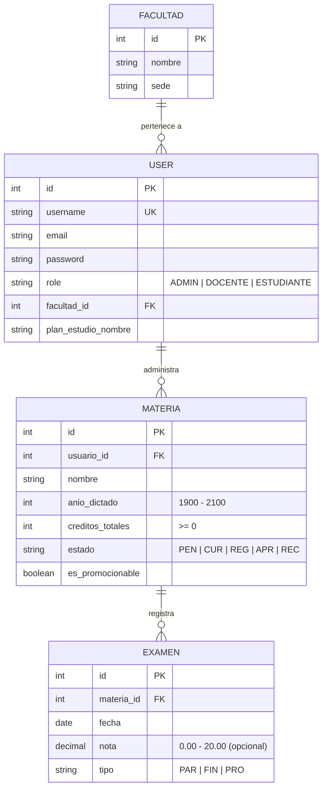

# Plataforma de Gestión de Carrera e Historial Académico

Sistema integral para la administración, seguimiento y planificación de la trayectoria académica de estudiantes universitarios. Permite centralizar el plan de estudios, registrar el estado de cursada por materia, administrar mesas de examen final e historial de calificaciones, y visualizar el progreso general de la carrera mediante indicadores dinámicos y lógica de semáforo.

---

## 🎯 Objetivos del Proyecto

- **Objetivo General**: Desarrollar una solución web modular (Backend RESTful + Frontend SPA) para gestionar el progreso académico, calificaciones y mesas de examen con control de acceso por roles e integridad de datos.
- **Objetivos Específicos**:
  - Implementar autenticación y autorización segura con JWT (JSON Web Tokens) y control de acceso basado en roles (RBAC).
  - Proveer endpoints CRUD con aislamiento estricto de recursos por usuario y permisos diferenciados (`ADMIN`, `DOCENTE`, `ESTUDIANTE`).
  - Validar reglas de negocio críticas a nivel de serializadores y modelos (rango de notas 0-20, años lectivos válidos, créditos positivos, unicidad de cuentas).
  - Desarrollar una interfaz de usuario interactiva y responsive con React 19, Vite y Bootstrap 5.3.
  - Garantizar calidad del software mediante **TDD (Test-Driven Development)** y principios de **Clean Code**.

---

## 🧭 Evolución y Alcance por Trabajos Prácticos

El repositorio reúne de forma progresiva las metas establecidas a lo largo de la cursada:

| Trabajo Práctico | Enfoque Principal | Entregables y Logros |
| :--- | :--- | :--- |
| **TP 1** | Puesta en marcha Backend | Entorno virtual, configuración base de Django y Django REST Framework, middleware CORS, smoke tests de infraestructura y superusuario. |
| **TP 2** | Modelado de datos y CRUD | Modelos `Facultad`, `Materia`, `Examen`, integración con PostgreSQL, ViewSets, enrutamiento, pruebas de contrato de entidades y documentación Swagger UI vía `drf-spectacular`. |
| **TP 3** | Seguridad e Identidad | App `users`, modelo personalizado `User` (`AbstractUser`), roles (`ADMIN`, `DOCENTE`, `ESTUDIANTE`), autenticación JWT (`/api/token/`, `/api/token/refresh/`), lista negra de tokens y permisos personalizados. |
| **TP 4** | Validación de API y Casos de Borde | Matriz de 61 pruebas, validaciones de rango (notas 0-20, año 1900-2100, créditos $\ge$ 0), aislamiento de datos por usuario, bypass administrativo y resolución de bugs mediante pull requests. |
| **TP 5** | Inicio del Frontend React | Inicialización del cliente web SPA en `Frontend/` utilizando Vite y React 19, configuración de scripts y estructura base de componentes. |
| **TP 6** | Maquetado Responsive (Bootstrap) | Interfaz completa de Home: Hero section, tarjetas de métricas, monitor de avance con semáforo por créditos, plan de estudio, mesas de examen, Navbar colapsable y Footer accesible. |
| **TP 7** | Sistema Auth en Frontend | Contexto global de autenticación (`AuthContext` + `useAuth`), rutas protegidas (`ProtectedRoute`), vistas completas de `Login` y `Register` con validaciones y alertas, y flujo de cierre de sesión (`Logout`). |
| **Rama `detalles`** | **Clean Code & TDD Integral** | Reanálisis y refactorización integral: 46 tests automatizados en Django (incluyendo smoke tests de TP1 y contratos de entidades/OpenAPI de TP2), 9 tests unitarios en Frontend (`node:test`), modularización de cálculos en `progress.js`, corrección de asignación de autoría en serializadores (`read_only_fields = ['usuario']`), validación de email duplicado y código libre de advertencias. |

---

## 🏗️ Arquitectura del Sistema

El proyecto está diseñado como un monorepositorio que separa claramente las responsabilidades del servidor API y del cliente web:

```
Programaci-n-1/
├── Gestor/               # Configuración global del proyecto Django (settings, urls, asgi, wsgi)
├── core/                 # App académica: modelos Facultad, Materia, Examen, endpoints CRUD y tests
├── users/                # App de identidad: modelo User personalizado, serializadores, permisos RBAC y tests
├── docs/                 # Matriz de pruebas de TP4 y colección de Postman
├── Frontend/             # Cliente Single Page Application (SPA)
│   ├── src/
│   │   ├── components/   # Componentes reutilizables (Navbar, Footer, ProtectedRoute)
│   │   ├── contexts/     # Context API para estado de autenticación (AuthContext)
│   │   ├── data/         # Mock data inicial para desarrollo
│   │   ├── hooks/        # Custom hooks (useAuth)
│   │   ├── utils/        # Utilidades puras testeadas (progress.js)
│   │   └── views/        # Vistas de la aplicación (Home, Login, Register)
│   └── package.json      # Dependencias y scripts de Node.js
└── requirements.txt      # Dependencias de Python
```

---

## 📐 Modelo de Datos y Relaciones


```mermaid
erDiagram
    FACULTAD ||--o{ USER : "pertenece a"
    USER ||--o{ MATERIA : "administra"
    MATERIA ||--o{ EXAMEN : "registra"

    FACULTAD {
        int id PK
        string nombre
        string sede
    }

    USER {
        int id PK
        string username UK
        string email
        string password
        string role "ADMIN | DOCENTE | ESTUDIANTE"
        int facultad_id FK
        string plan_estudio_nombre
    }

    MATERIA {
        int id PK
        int usuario_id FK
        string nombre
        int anio_dictado "1900 - 2100"
        int creditos_totales ">= 0"
        string estado "PEN | CUR | REG | APR | REC"
        boolean es_promocionable
    }

    EXAMEN {
        int id PK
        int materia_id FK
        date fecha
        decimal nota "0.00 - 20.00 (opcional)"
        string tipo "PAR | FIN | PRO"
    }
```

### Reglas de Integridad y Lógica de Negocio
1. **Cascada (`CASCADE`)**: La eliminación de un usuario remueve sus materias y exámenes dependientes.
2. **Aislamiento de Recursos**: Los estudiantes y docentes solo pueden consultar y operar sobre sus propias materias y exámenes asociados.
3. **Bypass Administrativo**: El rol `ADMIN` posee visibilidad global y permisos de modificación/eliminación sobre cualquier recurso académico.
4. **Protección de Facultades**: La lectura de facultades es pública; su alta, baja y modificación está reservada al administrador (`IsAdminOnly`).

---

## 🔌 Endpoints de la API REST

Documentación interactiva disponible en Swagger UI: `http://localhost:8000/api/docs/`

| Método | Endpoint | Rol Requerido | Descripción |
| :--- | :--- | :--- | :--- |
| `POST` | `/api/token/` | Público | Obtiene par de tokens JWT (`access` y `refresh`). |
| `POST` | `/api/token/refresh/` | Público | Renueva el token de acceso mediante el token de actualización. |
| `POST` | `/api/users/register/` | Público | Registro de nuevos usuarios (rol inicial `ESTUDIANTE`). |
| `GET` | `/api/users/me/` | Autenticado | Obtiene la información del perfil del usuario en sesión. |
| `GET` | `/api/facultades/` | Público | Lista todas las facultades registradas. |
| `POST` | `/api/facultades/` | `ADMIN` | Registra una nueva facultad institucional. |
| `GET` | `/api/facultades/{id}/`| Público | Obtiene el detalle de una facultad específica. |
| `PUT/PATCH/DELETE` | `/api/facultades/{id}/` | `ADMIN` | Modifica o da de baja una facultad. |
| `GET` | `/api/materias/` | Autenticado | Lista materias propias (los `ADMIN` ven todas). |
| `POST` | `/api/materias/` | `ADMIN`, `DOCENTE` | Crea una materia (asignación automática del autor autenticado). |
| `GET` | `/api/materias/{id}/` | Propietario / `ADMIN` | Obtiene el detalle de una materia. |
| `PUT/PATCH/DELETE` | `/api/materias/{id}/` | Propietario / `ADMIN` | Modifica o elimina una materia propia. |
| `GET` | `/api/examenes/` | Autenticado | Lista exámenes asociados a materias propias. |
| `POST` | `/api/examenes/` | `ADMIN`, `DOCENTE` | Registra examen para una materia propia (o cualquiera si es `ADMIN`). |
| `PUT/PATCH/DELETE` | `/api/examenes/{id}/` | Propietario / `ADMIN` | Modifica o elimina un examen asociado a su materia. |

---

## 🎨 Frontend (React + Vite + Bootstrap)

El cliente web se encuentra en el directorio [`Frontend/`](file:///home/alejrz/prog/Programaci-n-1/Frontend/README.md).

### Características Destacadas
- **Enrutamiento Declarativo**: Configurado con `react-router-dom` v7. Rutas públicas (`/login`, `/register`) y rutas protegidas (`/`) mediante el componente guard [`ProtectedRoute`](file:///home/alejrz/prog/Programaci-n-1/Frontend/src/components/ProtectedRoute.jsx).
- **Context API (`AuthContext`)**: Manejo centralizado del estado de sesión, métodos de autenticación, validación de credenciales y persistencia en memoria para desarrollo.
- **Monitor de Avance y Semáforo Académico**: Cálculo desacoplado en [`progress.js`](file:///home/alejrz/prog/Programaci-n-1/Frontend/src/utils/progress.js):
  - 🔴 **Crítico / Inicio**: 0% a 39% de créditos obtenidos (`text-bg-danger`).
  - 🟡 **En Proceso**: 40% a 74% de créditos obtenidos (`text-bg-warning`).
  - 🟢 **Avanzado / Completado**: 75% a 100% de créditos obtenidos (`text-bg-success`).
- **Paleta de Diseño**: Integración sobre variables SCSS/CSS de Bootstrap con color primario terracota (`#c05621`), garantizando contraste accesible WCAG AA.

---

## 🧪 Pruebas Automatizadas y Metodología TDD

El proyecto cuenta con suites de prueba automatizadas tanto en el backend como en el frontend, diseñadas bajo el ciclo **Red → Green → Refactor**:

### 1. Pruebas de Backend (Django Test Suite)
Ejecuta 46 pruebas de integración, comportamiento, infraestructura y contratos de API utilizando base de datos en memoria (`sqlite3`):
```bash
python manage.py test --settings=Gestor.test_settings -v 2
```
**Casos cubiertos:**
- **Infraestructura y Configuración Base (TP1)**: Verificación de `INSTALLED_APPS`, orden y prioridad de `CorsMiddleware` y disponibilidad del panel administrativo (`/admin/login/`).
- **Modelado de Datos y OpenAPI (TP2)**: Representación semántica de entidades (`__str__` en `Facultad`, `Materia`, `Examen`) y disponibilidad pública de Swagger UI (`/api/docs/`) y esquema OpenAPI (`/api/schema/`).
- Autenticación JWT (login exitoso, credenciales inválidas, refresh de token).
- Registro de usuarios con validación de unicidad de correo y username.
- Aislamiento multi-inquilino por usuario en consultas GET de materias y exámenes.
- Control estricto de permisos RBAC para facultades, materias y exámenes.
- Validaciones de borde: notas fuera de rango (< 0 o > 20), exámenes sin calificar (`nota=null`), años lectivos (< 1900 o > 2100) y créditos no negativos.

### 2. Pruebas de Frontend (Node.js Native Test Runner)
Ejecuta 9 pruebas unitarias sin dependencias externas pesadas:
```bash
npm --prefix Frontend test
```
**Casos cubiertos:**
- Redondeo y cálculo de porcentaje de créditos.
- Manejo de bordes: división por cero, créditos negativos, valores no numéricos o `NaN`.
- Clasificación estricta de rangos de semáforo (0, 39, 40, 74, 75, 100).

---

## ⚙️ Puesta en Marcha Local

### Requisitos Previos
- **Python**: 3.13 o superior
- **Node.js**: 18.0 o superior (con npm)
- **PostgreSQL**: Instalado localmente o vía Docker

### 1. Configuración del Backend

1. **Crear y activar el entorno virtual**:
   ```bash
   python -m venv .venv
   source .venv/bin/activate       # En Linux/macOS
   # .venv\Scripts\activate       # En Windows
   ```

2. **Instalar dependencias**:
   ```bash
   pip install -r requirements.txt
   ```

3. **Variables de entorno**:
   Crear un archivo `.env` basado en `.env.example`:
   ```env
   SECRET_KEY=django-insecure-development-key-32-chars-long
   DEBUG=True
   ALLOWED_HOSTS=localhost,127.0.0.1
   DB_NAME=programacion1_db
   DB_USER=postgres_django_user
   DB_PASSWORD=secret
   DB_HOST=localhost
   DB_PORT=5432
   ```

4. **Base de Datos (Docker opcional)**:
   Si dispone de Docker:
   ```bash
   docker compose up -d
   ```

5. **Aplicar migraciones y crear superusuario**:
   ```bash
   python manage.py migrate
   python manage.py createsuperuser
   ```

6. **Iniciar el servidor API**:
   ```bash
   python manage.py runserver
   ```
   El servidor estará disponible en `http://127.0.0.1:8000/`.

---

### 2. Configuración del Frontend

1. **Instalar dependencias**:
   ```bash
   cd Frontend
   npm install
   ```

2. **Ejecutar en modo de desarrollo**:
   ```bash
   npm run dev
   ```
   La aplicación se abrirá en `http://localhost:3000/`.

3. **Comandos útiles**:
   ```bash
   npm test        # Ejecuta las pruebas unitarias
   npm run lint    # Ejecuta el análisis estático con ESLint
   npm run build   # Genera el build optimizado para producción
   ```

---

## 🧼 Principios de Clean Code Aplicados

1. **Nombres Significativos e Intención Reveladora**: Constantes descriptivas (`SEMAFORO`, `ESTADO_BADGE`, `User.Role.ADMIN`), evitando números mágicos y cadenas repetidas.
2. **Funciones Pequeñas con Responsabilidad Única**: Separación de subcomponentes visuales (`StatCard`, `ProgressCard`, `PlanEstudioCard`, `MesasExamenCard`) y utilidades puras (`calcularPorcentaje`, `obtenerSemaforo`).
3. **Manejo Seguro de Errores y Validaciones**: Serializadores con validaciones explícitas de bordes y mensajes de error orientados a seguridad (mensajes genéricos en login para evitar enumeración de usuarios).
4. **Pruebas en Seams Públicos (TDD)**: Pruebas unitarias y de integración que verifican el contrato público de los endpoints y módulos, garantizando refactorizaciones seguras.

